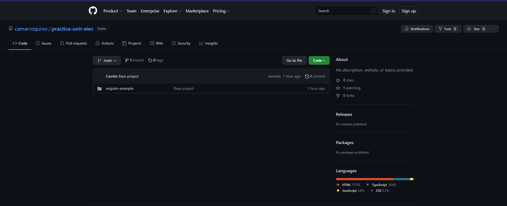
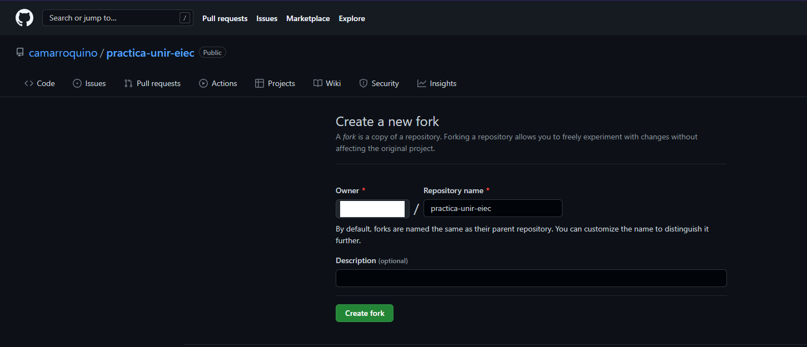
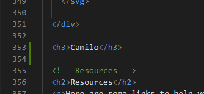

# practica-unir-eiec

## Realizar una copia del repositorio

- Visitar Url del repositorio -> [Repositorio de la practica](https://github.com/camarroquino/practica-unir-eiec).

  

- Dar clic en el botón "Fork"
  
  

- Iniciar sesión con las credeciales de la cuenta personal

  

- Crear el fork.

  

## Clonar el repositorio personal

En caso del repositorio principal

En el directorio deseado ejecutar:

```
  git clone https://github.com/camarroquino/practica-unir-eiec.git
```

## Ejecución de la aplicación

- Instalar [NodeJs](https://nodejs.org/en/).
- Ejecutar en la carpeta del proyecto "angular-example".

```
npm install
```

```
ng serve -o
```

## Modificar el codigo fuente

Modificar el archivo de la ruta *angular-example\src\app\app-routing.module.ts*

Duplicar linea 353

  

## Trtabajo con la rama

Generar la rama
```
git branch camilo_modification
```